# Copilot Studio Agent Credits Reporting

This code repository contains PowerShell scripts to generate a comprehensive report of all Copilot Studio agents across your Power Platform environments. The report includes key details such as agent identifiers, environment information, creation and modification dates, and credit usage.

---

## � Get-CompleteCopilotReport.ps1 Workflow

```mermaid
flowchart TD
    Start([Start Script]) --> CheckCreds{Credentials<br/>Provided?}
    
    CheckCreds -->|No| PromptCreate{Create New<br/>Service Principal?}
    CheckCreds -->|Yes| GetTokens[Get Authentication Tokens]
    
    PromptCreate -->|No| ExitMsg[Display Instructions<br/>and Exit]
    PromptCreate -->|Yes| CheckPac{pac CLI<br/>Installed?}
    
    CheckPac -->|No| InstallPac[Auto-install via winget]
    CheckPac -->|Yes| AuthCheck{Authenticated<br/>to Power Platform?}
    InstallPac --> RestartMsg[Restart PowerShell<br/>and Rerun]
    
    AuthCheck -->|No| AuthPrompt[Prompt: pac auth create]
    AuthCheck -->|Yes| ListEnv[List Environments]
    AuthPrompt --> ListEnv
    
    ListEnv --> SelectEnv[Prompt: Enter Environment ID]
    SelectEnv --> CreateSP[Create Service Principal<br/>pac admin create-service-principal]
    
    CreateSP --> ParseCreds[Parse Credentials<br/>ClientId, ClientSecret]
    ParseCreds --> DisplayCreds[Display Credentials<br/>with Example Command]
    
    DisplayCreds --> MultiEnv{Register to<br/>Additional Environments?}
    MultiEnv -->|Yes| EnterEnvId[Prompt: Enter Environment ID]
    EnterEnvId --> RegisterSP[Register Service Principal<br/>to Environment]
    RegisterSP --> MoreEnv{Continue with<br/>More Environments?}
    MoreEnv -->|Yes| EnterEnvId
    MoreEnv -->|No| GetTokens
    MultiEnv -->|No| GetTokens
    
    GetTokens --> QueryAdmin[Query Power Platform Admin API<br/>Get All Environments]
    QueryAdmin --> LoopEnv{For Each<br/>Environment}
    
    LoopEnv --> QueryDataverse[Query Dataverse API<br/>bots, systemusers, botcomponents]
    QueryDataverse --> NextEnv{More<br/>Environments?}
    NextEnv -->|Yes| LoopEnv
    NextEnv -->|No| QueryLicense[Query Licensing API<br/>Get Credits Data]
    
    QueryLicense --> MergeData[Merge All Data<br/>Agents + Owners + Credits]
    MergeData --> ExportCSV[Export to CSV<br/>CopilotAgents_CompleteReport_*.csv]
    ExportCSV --> End([Complete])
    
    ExitMsg --> Stop([Exit])
    RestartMsg --> Stop
    
    style Start fill:#e1f5e1
    style End fill:#e1f5e1
    style Stop fill:#ffe1e1
    style CheckCreds fill:#fff4e1
    style PromptCreate fill:#fff4e1
    style CheckPac fill:#fff4e1
    style AuthCheck fill:#fff4e1
    style MultiEnv fill:#fff4e1
    style MoreEnv fill:#fff4e1
    style LoopEnv fill:#e1f0ff
    style NextEnv fill:#e1f0ff
    style CreateSP fill:#f0e1ff
    style RegisterSP fill:#f0e1ff
    style GetTokens fill:#ffe1f5
    style QueryAdmin fill:#e1f0ff
    style QueryDataverse fill:#e1f0ff
    style QueryLicense fill:#e1f0ff
    style MergeData fill:#e1ffe1
    style ExportCSV fill:#e1ffe1
```



---

## �📋 Available Scripts

### 1. Get-CompleteCopilotReport.ps1 ⭐ RECOMMENDED
**Status:** ✅ Production-ready  
**Authentication:** Service principal (automated setup)  
**Coverage:** ALL agents across ALL environments + credits data

**Features:**
- **Zero-parameter execution** - automated service principal creation
- Power Platform CLI auto-installation
- Multi-environment registration support
- Queries three APIs:
  - Power Platform Admin API (environments)
  - Dataverse API (bot details per environment)
  - Licensing API (credits consumption)
- Comprehensive agent data with owner names, creation dates, and usage metrics
- Single service principal works across all environments

**Quick Start:**
```powershell
# Interactive mode - handles everything automatically
.\Get-CompleteCopilotReport.ps1
```

**Automated mode** (with existing credentials):
```powershell
.\Get-CompleteCopilotReport.ps1 -TenantId "" -ClientId "" -ClientSecret ""
```

**Output:** `CopilotAgents_CompleteReport_YYYYMMDD_HHMMSS.csv` with comprehensive agent data

**Setup Documentation:** See [../docs/ENTRA-APP-SETUP.md](../docs/ENTRA-APP-SETUP.md)

---

### 2. Get-AllAgents-InventoryAPI-v2.ps1
**Status:** ✅ Production-ready  
**Authentication:** Interactive device code flow  
**Coverage:** ALL agents across ALL environments  

**Features:**
- Queries Power Platform Inventory API
- Gets all Copilot Studio agents in single call
- Joins with environment data automatically
- Returns 9 of 12 mandatory customer fields

**Available Fields:**
- Agent ID, Name, Type
- Environment ID, Name, Type, Region
- Created At, Modified At
- Owner ID, Created By

**Usage:**
```powershell
.\Get-AllAgents-InventoryAPI-v2.ps1
```

**Output:** `CopilotAgents_InventoryAPI.csv` with complete agent inventory

**API Endpoint:**  
`POST https://api.powerplatform.com/resourcequery/resources/query?api-version=2024-10-01`

---

### 2. Get-AllCopilotAgents-InventoryAPI.ps1
**Status:** ✅ Alternative version (basic query without join)  
**Authentication:** Interactive device code flow  
**Coverage:** ALL 115 agents  

**Usage:**
```powershell
.\Get-AllCopilotAgents-InventoryAPI.ps1
```

---

### 3. Create-FinalReport.ps1
**Status:** ✅ Report formatter  
**Input:** Admin Center CSV export or Inventory API output  
**Output:** Formatted report with 12 mandatory fields  

**Features:**
- Reads CSV export (Admin Center or Inventory API)
- Maps to customer-required 12 fields
- Adds field status indicators
- Creates standardized report format

**Usage:**
```powershell
.\Create-FinalReport.ps1 -InputCsv "..\PPAC_Copilot Studio Agents Inventory.csv"
```

---

## 📊 Field Mapping

The Inventory API provides **9 of 12** mandatory customer fields:

| Customer Field | Inventory API Field | Status |
|---|---|---|
| Agent Identifier | `name` | ✅ Available |
| Environment ID | `properties.environmentId` | ✅ Available |
| Agent Name | `properties.displayName` | ✅ Available |
| Agent Description | - | ❌ Not in API |
| Created At | `properties.createdAt` | ✅ Available |
| Updated At | `properties.modifiedAt` | ✅ Available |
| Solution ID | - | ⚠️ Requires Dataverse |
| Agent Owner | `properties.ownerId` | ✅ Available |
| Active Users | - | ⚠️ Requires Dataverse |
| Billed Credits | - | ❌ Not exposed |
| Non-Billed Credits | - | ❌ Not exposed |
| Is Published | - | ⚠️ Requires Dataverse |

---

## 🚀 Quick Start

**Complete report with credits (recommended):**

```powershell
# Navigate to scripts folder
cd "c:\repos\AgentCustomReport\scripts"

# Run complete report (first time - interactive setup)
.\Get-CompleteCopilotReport.ps1

# Follow prompts to:
# 1. Create service principal (Y/N)
# 2. Authenticate to Power Platform
# 3. Select environment
# 4. Register to additional environments (optional)
# 5. Save displayed credentials for future runs

# Future runs with saved credentials
.\Get-CompleteCopilotReport.ps1 -TenantId "..." -ClientId "..." -ClientSecret "..."
```

**Basic inventory only (no credits):**

```powershell
# Simple agent list without authentication
.\Get-AllAgents-InventoryAPI-v2.ps1

# Output file created
# Result: ..\CopilotAgents_InventoryAPI.csv
```

**Expected Results:**
- 115 agents total
- 80 from Contoso (default)
- 16 from Prod
- 11 from Dev Env
- 8 from other environments

---

## 📖 API Documentation

### Get-CompleteCopilotReport.ps1 APIs

**1. Power Platform Admin API**  
- **Endpoint:** `https://api.bap.microsoft.com/providers/Microsoft.BusinessAppPlatform/scopes/admin/environments`
- **Purpose:** Enumerate all environments in tenant
- **Authentication:** Service principal with Power Platform API permissions

**2. Dataverse API**  
- **Endpoint:** `https://{org}.crm.dynamics.com/api/data/v9.2/`
- **Resources:** `bots`, `systemusers`, `botcomponents`
- **Purpose:** Detailed bot/agent data per environment
- **Authentication:** Service principal registered to environment (via pac CLI)

**3. Licensing API**  
- **Endpoint:** `https://licensing.powerplatform.microsoft.com/v0.1-alpha/tenants/{tenantId}/entitlements/MCSMessages`
- **Purpose:** Credits consumption data
- **Authentication:** Service principal with licensing permissions

### Get-AllAgents-InventoryAPI-v2.ps1 API

**Power Platform Inventory API:**  
https://learn.microsoft.com/en-us/power-platform/admin/inventory-api

**Resource Type:**  
`microsoft.copilotstudio/agents`

**Query Structure:**
```json
{
  "Options": { "Top": 1000, "Skip": 0 },
  "TableName": "PowerPlatformResources",
  "Clauses": [
    {
      "$type": "where",
      "FieldName": "type",
      "Operator": "in~",
      "Values": ["'microsoft.copilotstudio/agents'"]
    }
  ]
}
```

---

## 🔧 Troubleshooting

### Get-CompleteCopilotReport.ps1

**Issue:** "Power Platform CLI not found"  
**Solution:** Script auto-installs via winget. If failed, restart PowerShell or install manually: `winget install Microsoft.PowerPlatformCLI`

**Issue:** "Authentication failed: 401 Unauthorized"  
**Solution:** Invalid or expired client secret. Create new service principal or verify credentials

**Issue:** "Service Principal doesn't have access to environment"  
**Solution:** Run script with existing credentials and register to additional environments

**Issue:** Script creates new service principal every time  
**Solution:** Provide credentials as parameters: `.\Get-CompleteCopilotReport.ps1 -TenantId "..." -ClientId "..." -ClientSecret "..."`

**Issue:** Need Power Platform Administrator role  
**Solution:** Service principal creation requires this role - contact your tenant admin

### Get-AllAgents-InventoryAPI-v2.ps1

**Issue:** Authentication fails  
**Solution:** Ensure you have Global Admin or Power Platform Admin role

**Issue:** Returns fewer than expected agents  
**Solution:** Check pagination - increase `Top` value or implement skipToken handling

**Issue:** Environment names missing  
**Solution:** Use `-v2` version which includes environment join

---

## 📝 Version History

**v2 (January 2026) - Inventory API**
- ✅ Uses official Power Platform Inventory API
- ✅ Single authentication for all environments
- ✅ Complete 115 agent coverage
- ✅ Environment metadata included

**v1 (September 2025) - Multiple approaches**
- ⚠️ Dataverse API (per-environment auth required)
- ⚠️ PAC CLI (undercounts agents)
- ✅ Admin Center CSV export (manual)

---

## 📄 License

Scripts provided as-is for Microsoft internal use. Requires appropriate Power Platform permissions.
